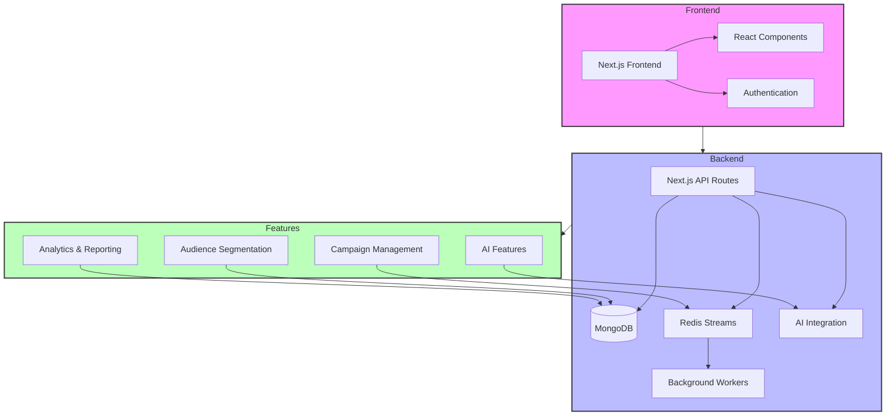

# Mini CRM - Xeno Assignment

##  Project Overview
A modern CRM system built with Next.js that helps businesses manage customer relationships, create targeted campaigns, and analyze customer interactions. This project demonstrates the implementation of a scalable CRM for XENO ,solution with AI-powered features and real-time analytics.

## ⚙️Local Setup Instructions

1. Clone the repository:
```bash
git clone <repository-url>
cd mini-crm
```

2. Install dependencies:
```bash
npm install
```

3. Set up environment variables:
Create a `.env` file in the root directory with the following variables:
```env
MONGODB_URI=your_mongodb_connection_string
NEXTAUTH_SECRET=your_nextauth_secret
NEXTAUTH_URL=http://localhost:3000
```

4. Run the development server:
```bash
npm run dev
```

The application will be available at `http://localhost:3000`

## Architecture Diagram



### System Components

1. **Frontend Layer**
   - Next.js application with TypeScript
   - React components for UI
   - Authentication system
   - Responsive design with Tailwind CSS

2. **Backend Layer**
   - Next.js API routes
   - MongoDB database
   - Redis Streams for message queue
   - Background workers for campaign processing
   - AI integration for smart features

3. **Feature Modules**
   - Campaign Management
     - Campaign creation and scheduling
     - Message templates
     - Delivery tracking
   - Audience Segmentation
     - Rule-based segmentation
     - Natural language rule processing
     - Audience preview
   - Analytics & Reporting
     - Campaign performance metrics
     - Audience insights
     - Delivery statistics
   - AI Features
     - Smart send time optimization
     - Message suggestions
     - Campaign auto-tagging
     - Natural language processing

### Data Flow

1. User interactions flow through the Next.js frontend
2. API routes handle business logic and data operations
3. MongoDB stores persistent data (customers, campaigns, segments)
4. Redis Streams manage asynchronous operations
5. Background workers process campaign deliveries
6. AI services enhance user experience and automation

##  AI Tools and Features Used

### Development Tools


### AI-Powered Features
1. **AI Rule Translation**
   - Converts natural language segment rules to structured format
   - Example: "Customers who haven't purchased in 30 days" → Structured rule

2. **AI-Generated Message Suggestions**
   - Context-aware message variants for campaigns
   - Personalized content based on customer segments

3. **Campaign Summary with Natural Language Insights**
   - Automated campaign performance summaries
   - Natural language delivery statistics

4. **Smart Send Time**
   - Simulated optimal send time calculation
   - Timezone-aware scheduling

5. **Campaign Auto-tagging**
   - Automatic categorization of campaigns
   - Tags: "Win-back", "High Value", "Engagement", etc.

##  Known Limitations or Assumptions

### Simulated Features
- Smart Send Time calculations are simulated
- Lookalike Audience features are not production-grade
- Redis Streams/Kafka implementation is for development only

### Technical Limitations
- Basic error handling implementation
- Simple auth token expiration handling
- Limited analytics capabilities
- No production-grade scaling

### Future Improvements
- Implement proper message queue scaling
- Add comprehensive error handling
- Enhance analytics capabilities
- Add more AI-powered features 